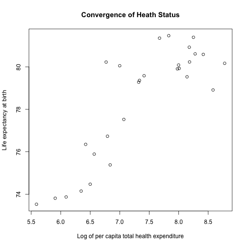
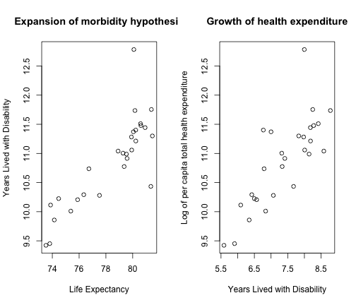

Expansion of morbidity, the financial crisis and the sustainability of health expenditure in the European Union. A reproducible analysis
================================================================

### Stefano Olgiati, Niccolò Marchionni, Marco Scatigna, Emilio Clementi, Alessandro Danovi, Paolo Rossetti, Roberto Weinstein, Giancarlo Cesana

### Abstract
**Background**
The Global Burden of Disease study 2010 has revealed that 28 countries of the European Union are characterized by an uneven distribution of both Health Adjusted Life Expectancy and the number of Years Lived  for both sexes. In this paper we have tested the null hypothesis that, across the European Union, the is no correlation between per capita health expenditure and the distribution of the number of Years Lived with Disease.

**Methods**
We have utilized the Global Burden of Disease Study 2010 and the WHO Global Health Expenditure Statistics Repository open access datasets and we have conducted our statistical analysis with R knitr open source software and made our code available to other researchers

**Findings**
Our findings are consistent with the expansion of morbidity hypothesis: the number of Years Lived with Disability grows linearly with Life Expectancy (slope 0.24; 95% CI 0.17-0.30; R2=0.69), and the log of Total Health Expenditure grows linearly with the number of Years Lived with Disability (slope 0.56; 95% CI 0.38-0.73; R2=0.62).

**Interpretation**
We conclude that health expenditure is correlated to the number of years lived with disability (p<0.001). Our interpretation is that, in the European Union, as overall life expectancy at birth for both sexes increases, preventing higher incidence, duration and severity of disease must become a priority in order to stabilize health expenditure growth and achieve a sustainable public health policy.

**Keywords**
Years Lived With Disability, Total Health Expenditure Per Capita, Disease Prevention, Sustainable European Public Health Policy


```
## Loading required package: bitops
## Loading required package: bibtex
## 
## Attaching package: 'knitcitations'
## 
## The following object is masked from 'package:utils':
## 
##     cite
```


### INTRODUCTION
The European Union is in general characterised by constantly improving life expectancy at birth in the period 1970-2009 (<a href="http://dx.doi.org/10.1093/ije/dyr061">Leon, 2011</a>) [See Figure 1 in (Leon 2011)] ("http://ije.oxfordjournals.org/content/40/2/271/F1.expansion.html") with some socioeconomic inequalities remaining unsolved and affecting the equal distribution of health outcomes (<a href="http://dx.doi.org/10.1056/NEJMsa0707519">Mackenbach et al. 2008</a>). 

After 2007-8, following the *incipit* of the financial crisis, Karanikolos et al. in 2013 (<a href="http://dx.doi.org/10.1016/S0140-6736(13)60102-6">Karanikolos et al. 2013</a>) have risen some concerns regarding the effects of an enduring crisis on public health in some countries like Italy, Greece and Portugal.

These concerns, coupled by a growing consensus of the risk, banking and finance academic community on the financial safety of the financial system itself [See IRMC 2014]("http://www.irmc.eu"), have led the authors of this paper to analyse the relationship between life expectancy, the burden of disease in terms of the number of years lived with disability, and per capita total health expenditure accross the European Union in the year 2010.

### LITERATURE
In literature the assessment of the relationship between health expenditure and life expectancy has been much debated and is controversial. We have analysed two major hypotheses:

*Hypothesis I) the convergence of health and socioeconomic status and the diminishing returns of health expenditure*;   
*Hypothesis II) the expansion of morbidity hypothesis and the growth of health expenditure*.

#### Hypothesis I) The convergence of health and socioeconomic status and the diminishing returns of health expenditure
Social epidemiologists and economists have since long debated the relationship between life expectancy and socioeconomic status. The role of *distal* socioeconomic determinants of health such as gross domestic product per capita, health expenditure and health coverage was originally proposed by Preston in 1975 (<a href="http://dx.doi.org/10.2307/2173509">Preston, 1975</a>), McMichael in 1999 (<a href="http://dx.doi.org/10.1093/oxfordjournals.aje.a009732">McMichael, 1999</a>) and 2004 (<a href="http://dx.doi.org/10.1016/S0140-6736(04)15902-3">McMichael et al. 2004</a>) and Deaton in 2003 (<a href="http://dx.doi.org/10.1257/002205103321544710">Deaton, 2003</a>). In general, if life expectancy is considered a sufficiently explanatory descriptor of health outcomes (<a href="http://dx.doi.org/10.1093/ije/dyr061">Leon, 2011</a>), the hypothesis to be tested is if a growing health expenditure is correlated to a longer life expectancy and if this correlation is characterised or not by diminishing returns (Figure 1).

Figure 1
 


#### Hypothesis II) The expansion of morbidity hypothesis and the growth of health expenditure
In alternative, increased health spending can be explained by the growth in the number of years lived with disability which, in turn, can be explained by the growth of overall life expectancy at birth (Figure 2).

As Salomon and colleagues (<a href="http://dx.doi.org/10.1016/S0140-6736(12)61690-0">Salomon et al. 2012</a>) summarised in the Global Burden of Disease Study (February 2013 update) (<a href="http://dx.doi.org/10.1016/S0140-6736(12)61729-2">Vos et al. 2012</a>), improving health: “means more than simply delaying death or increasing life expectancy at birth”, and “in the period 1990-2010 improvements in healthy life expectancy have mainly been achieved through reductions of child and adult mortality rates rather than reductions in non-fatal diseases, health risks and injuries”, which might imply survival, but with residual functional limitations and disabilities.

Figure 2
 


### RESEARCH QUESTION
We have reproduced the analysis under the assumptions of Hypothesis I and II for the European Union in the year 2010.


### CODE BOOK, METHODS AND RAW DATA
We utilized open access data from the Institute for Health Metrics and Evaluation (IHME) Global Burden of Disease Study 2010 [GHDx]("http://ghdx.healthmetricsandevaluation.org/sites/default/files/record-attached-files/IHME_GBD_2010_HALE_BY_COUNTRY_1990_2010_Y2010M02D23.CSV") and from the World Health Organization’s [Data Repository on Health Expenditure]("http://apps.who.int/gho/athena/data/xmart.csv?target=GHO/WHS7_156,WHS7_105,WHS7_104,WHS7_108&profile=xmart&filter=COUNTRY:*;REGION:AFR;REGION:AMR;REGION:SEAR;REGION:EUR;REGION:EMR;REGION:WPR").

#### Code Book
The following variables and definitions, based on “The Global Burden of Disease: Generating Evidence, Guiding Policy” and the World Health Organization’s Data Repository on Health Expenditure, were adopted:
* Life Expectancy (LE): Life Expectancy at birth is the average number of years that a person can be expected to live from birth;
* Healthy Life Expectancy (HALE): Healthy Life Expectancy is the average number of years that a person can be expected to live in “full health”, by taking into account years lived in less than full health with disease and/or non-fatal injury ;
* Years Lived with Disability (YLD): The Years Lived with Disability is the difference between LE and HALE, where LE is always greater than or equal to HALE. It is equivalent to the number of years that people live with a health condition or its consequences or in less than full health with disease and/or non-fatal injury , .
* Total Health Expenditure (THE): Total Health Expenditure includes public (government, external resources for health from international programs and social security) and private expenditure (private pre-paid plans and out-of-pocket). For the purpose of international comparisons, THE is expressed in International Purchase Power Parity United States Dollars (USD PPP) which, according to the World Bank, is the number of units of a country’s currency required to buy the same amounts of goods and services in the domestic market as one US Dollar would buy in the United States .

#### Getting Data Code

```r
fileURL.GBD <- "http://ghdx.healthmetricsandevaluation.org/sites/default/files/record-attached-files/IHME_GBD_2010_HALE_BY_COUNTRY_1990_2010_Y2010M02D23.CSV"
fileURL.WHO <- "http://apps.who.int/gho/athena/data/xmart.csv?target=GHO/WHS7_156,WHS7_105,WHS7_104,WHS7_108&profile=xmart&filter=COUNTRY:*;REGION:AFR;REGION:AMR;REGION:SEAR;REGION:EUR;REGION:EMR;REGION:WPR"
download.file(fileURL.GBD, destfile = "/Users/Stefanoolgiati/Desktop/YLD/YLD.RPubs/YLD_2010_EU28/GBD.csv")
download.file(fileURL.WHO, destfile = "/Users/Stefanoolgiati/Desktop/YLD/YLD.RPubs/YLD_2010_EU28/WHO.csv")
dateDownloaded <- date()
dateDownloaded
```

```
## [1] "Sat May 17 11:01:09 2014"
```


#### Raw Data

```
## [1] "iso3"         "country_name" "year"         "age_name"    
## [5] "sex_name"     "le"           "le_ui"        "hale"        
## [9] "hale_ui"
```


#### Analytic Data

```
##      NAME     NROW MB
## [1,] DT.GBD 50,490 4 
## [2,] DT.WHO 13,496 1 
##      COLS                                                                          
## [1,] iso3,country_name,year,age_name,sex_name,le,le_ui,hale,hale_ui                
## [2,] Dataset,GHO,PUBLISHSTATE,YEAR,REGION,COUNTRY,Display,Numeric,Low,High,Comments
##      KEY
## [1,]    
## [2,]    
## Total: 5MB
```

```
## [1] TRUE
```


#### Tidy Dataset

```r
tidy.data <- data.frame(country = data.GBD.ordered$iso3, the = data.WHO.ordered$Display, 
    log.the, le = data.GBD.ordered$le, hale = data.GBD.ordered$hale, yld)
tidy.data
```

```
##    country    the log.the    le  hale    yld
## 1      AUT 3937.1   8.278 80.61 69.13 11.478
## 2      BEL 3431.8   8.141 79.53 68.54 10.989
## 3      BGR  267.4   5.589 73.53 64.10  9.423
## 4      CYP  870.7   6.769 80.23 68.83 11.401
## 5      CZE 1176.0   7.070 77.52 67.24 10.280
## 6      DEU 3582.1   8.184 80.23 69.02 11.213
## 7      DNK 5334.1   8.582 78.91 67.87 11.040
## 8      ESP 2153.4   7.675 81.35 70.92 10.434
## 9      EST  711.6   6.568 75.89 65.68 10.206
## 10     FIN 2973.6   7.998 80.09 67.30 12.783
## 11     FRA 3565.3   8.179 80.93 69.48 11.443
## 12     GBR 2915.0   7.978 79.91 68.62 11.282
## 13     GRC 1657.0   7.413 79.58 68.67 10.914
## 14     HRV  891.0   6.792 76.73 66.00 10.737
## 15     HUN  664.8   6.499 74.47 64.25 10.225
## 16     IRL 3004.7   8.008 79.93 68.87 11.058
## 17     ITA 2516.3   7.831 81.47 70.17 11.300
## 18     LTU  570.1   6.346 74.15 64.29  9.858
## 19     LUX 6493.7   8.779 80.17 68.43 11.736
## 20     LVA  442.1   6.092 73.87 63.76 10.114
## 21     MLT 1096.7   7.000 80.05 68.68 11.371
## 22     NLD 4520.5   8.416 80.59 69.08 11.511
## 23     POL  615.6   6.423 76.35 66.06 10.292
## 24     PRT 1532.3   7.335 79.36 68.59 10.775
## 25     ROU  367.4   5.906 73.81 64.36  9.452
## 26     SVK  932.6   6.838 75.38 65.37 10.010
## 27     SVN 1512.2   7.321 79.28 68.28 11.004
## 28     SWE 3826.3   8.250 81.39 69.64 11.754
```

```r
attach(tidy.data)
```

```
## The following objects are masked _by_ .GlobalEnv:
## 
##     log.the, yld
## The following objects are masked from raw.data.GBD:
## 
##     hale, le
```


#### Graphic Analysis Code
  


#### Analysis Code


### FINDINGS
We found that, as YLD increases, an increasing share of economic resources is dedicated not only to reducing mortality, but also to reducing the incidence, duration and severity of diseases that cause morbidity, comorbidity and multimorbidity, but not mortality.  

In 2010, across 28 Countries of the European Union, the log of per capita Total Health Expenditure is a linear function of the number of Years Lived with Disability ((slope 0.56; 95% CI 0.38-0.73; R2=0.62) (Exhibits 3 and 4). We have called this relationship Disability Costs Function.


```r
summary(lm.fit1)
```

```
## 
## Call:
## lm(formula = yld ~ le)
## 
## Residuals:
##     Min      1Q  Median      3Q     Max 
## -1.1297 -0.1806 -0.0367  0.1206  1.5215 
## 
## Coefficients:
##             Estimate Std. Error t value Pr(>|t|)    
## (Intercept)  -7.8397     2.4456   -3.21   0.0036 ** 
## le            0.2385     0.0312    7.65    4e-08 ***
## ---
## Signif. codes:  0 '***' 0.001 '**' 0.01 '*' 0.05 '.' 0.1 ' ' 1
## 
## Residual standard error: 0.43 on 26 degrees of freedom
## Multiple R-squared:  0.692,	Adjusted R-squared:  0.681 
## F-statistic: 58.5 on 1 and 26 DF,  p-value: 4.05e-08
```

```r
confint(lm.fit1)
```

```
##                2.5 %  97.5 %
## (Intercept) -12.8667 -2.8127
## le            0.1744  0.3026
```

```r
summary(lm.fit2)
```

```
## 
## Call:
## lm(formula = log.the ~ yld)
## 
## Residuals:
##     Min      1Q  Median      3Q     Max 
## -1.1441 -0.3152  0.0524  0.3683  1.0495 
## 
## Coefficients:
##             Estimate Std. Error t value Pr(>|t|)    
## (Intercept)   -2.660      1.504   -1.77    0.089 .  
## yld            0.923      0.138    6.68  4.4e-07 ***
## ---
## Signif. codes:  0 '***' 0.001 '**' 0.01 '*' 0.05 '.' 0.1 ' ' 1
## 
## Residual standard error: 0.546 on 26 degrees of freedom
## Multiple R-squared:  0.632,	Adjusted R-squared:  0.618 
## F-statistic: 44.6 on 1 and 26 DF,  p-value: 4.36e-07
```

```r
confint(lm.fit2)
```

```
##               2.5 % 97.5 %
## (Intercept) -5.7526 0.4323
## yld          0.6392 1.2073
```


In general, this epidemiological relationship is true for almost all high- and middle-income European countries . The Institute for Health Metrics and Evaluation (IHME) Global Burden of Disease Study 2010 (2013 update) has found evidence in favour of the expansion of morbidity hypothesis  (<a href="http://dx.doi.org/10.1001/jama.2013.13805">Murray, 2013</a>). Exhibit 2 shows that in 2010, in the 28 EU countries, the increase in life expectancy at birth is accompanied by a linear increase in the number of years lived with disability ((slope 0.24; 95% CI 0.17-0.30; R2=0.69), with 2.9 months of healthy life lost for each additional year of life lived .

Given this correlation between life expectancy at birth and the number of years lived with disability, our research question is whether total health expenditure per capita (THE) is a function of the number of years lived with such disability (YLD), defined as the difference between life expectancy (LE) and health-adjusted life expectancy (HALE) and, if so, what shape this distribution has.

These results confirm the findings in the US by Murray et al. (<a href="http://dx.doi.org/10.1056/NEJMra1201534">Murray & Lopez, 2013</a>)  in the United States who concluded that “the US [...] made notable progress in improving health in the two decades from 1990 to 2010” but “in a marked shift, non-fatal disease and disability accounted for almost half of all health burden in the US in 2010”.

### CONCLUSIONS
In Greek mythology Sisyphus was the symbol of futile labour  condemned to push a boulder up a hill only to watch it roll back down, and repeat this action forever . European public health policymakers might be heading towards the same fate: while there is an improvement in socioeconomic distal determinants of health (such as per capita Gross Domestic Product , living standards and education, accessibility to health services  and medical practices  with reduced inequalities and crime rates), and life expectancy at birth in all 28 EU countries continues to rise, at the same time the number of years lived with disease, non-fatal injury and disability also increases , requiring policymakers to invest more and more economic resources in health care. 

The implications of the Disability Costs Function are not trivial:

a) Comparing among different countries, the efficiency of health spending is significant only vertically along the Disability Costs Function, and effectiveness is significant only horizontally. For example, Sweden (YLD 11.75: THE 3,759 ) is more efficient than Luxembourg (YLD 11.74; THE 6,711), less effective than Ireland (YLD 11.06; THE 3,719), and less efficient and less effective than the United Kingdom (YLD 11.28; THE 3,433);

b) If adequate public health policies aimed at preventing non-fatal disease and injury are not adopted , countries with lower life expectancy at birth, lower number of years lived with disability and lower per capita total health expenditure, like Bulgaria, Romania, Lithuania, Latvia, Estonia, Poland, Hungary, Czech Republic and Slovakia will face exponential growth in disability and health expenditure as life expectancy at birth improves;

c) European financial stability goals and policies aimed at securing economic and financial sustainability of health financing in the EU  should take into account the differential burden of disability and promote reforms towards reducing the incidence, duration and severity of disabling diseases as overall life expectancy increases in the Union;

d) European countries enduring the 2008 financial crisis , such as Greece, Cyprus, Portugal, Italy, Ireland and Spain, which are forced to adopt budgetary reform measures, should focus on cost-effective public health policies aimed at moving horizontally along the Disability Costs Function towards reducing disability at the present total health expenditure per capita.

We conclude that the value of a sustainable public health policy should also be measured in terms of increasing health-adjusted life expectancy (HALE) and reducing the number of years lived with disability (YLD) “given” a certain level of total health expenditure per capita in terms of less money spent for more years lived in good health.

In the absence of these goals, political economy and health economic policies will deliver more wealth per capita and a longer life, but also, at the same time, more years of disease - and at a higher cost.

  
### REFERENCES  

```
## 
## - Angus Deaton,   (2003) Health, Inequality, And Economic Development.  *Journal of Economic Literature*  **41**  113-158  [10.1257/002205103321544710](http://dx.doi.org/10.1257/002205103321544710)
## - Marina Karanikolos, Philipa Mladovsky, Jonathan Cylus, Sarah Thomson, Sanjay Basu, David Stuckler, Johan P Mackenbach, Martin McKee,   (2013) Financial Crisis, Austerity, And Health in Europe.  *The Lancet*  **381**  1323-1331  [10.1016/S0140-6736(13)60102-6](http://dx.doi.org/10.1016/S0140-6736(13)60102-6)
## - D. A. Leon,   (2011) Trends in European Life Expectancy: A Salutary View.  *International Journal of Epidemiology*  **40**  271-277  [10.1093/ije/dyr061](http://dx.doi.org/10.1093/ije/dyr061)
## - Johan P. Mackenbach, Irina Stirbu, Albert-Jan R. Roskam, Maartje M. Schaap, Gwenn Menvielle, Mall Leinsalu, Anton E. Kunst,   (2008) Socioeconomic Inequalities in Health in 22 European Countries.  *New England Journal of Medicine*  **358**  2468-2481  [10.1056/NEJMsa0707519](http://dx.doi.org/10.1056/NEJMsa0707519)
## - A. J. McMichael,   (1999) Prisoners of The Proximate: Loosening The Constraints on Epidemiology in an Age of Change.  *American Journal of Epidemiology*  **149**  887-897  [10.1093/oxfordjournals.aje.a009732](http://dx.doi.org/10.1093/oxfordjournals.aje.a009732)
## - Anthony J McMichael, Martin McKee, Vladimir Shkolnikov, Tapani Valkonen,   (2004) Mortality Trends And Setbacks: Global Convergence or Divergence?.  *The Lancet*  **363**  1155-1159  [10.1016/S0140-6736(04)15902-3](http://dx.doi.org/10.1016/S0140-6736(04)15902-3)
## - Christopher J. L. Murray,   (2013) The State of us Health, 1990-2010.  *Jama*  **310**  591-NA  [10.1001/jama.2013.13805](http://dx.doi.org/10.1001/jama.2013.13805)
## - Christopher J.L. Murray, Alan D. Lopez,   (2013) Measuring The Global Burden of Disease.  *New England Journal of Medicine*  **369**  448-457  [10.1056/NEJMra1201534](http://dx.doi.org/10.1056/NEJMra1201534)
## - Samuel H. Preston,   (1975) The Changing Relation Between Mortality And Level of Economic Development.  *Population Studies*  **29**  231-NA  [10.2307/2173509](http://dx.doi.org/10.2307/2173509)
## - Joshua A Salomon, Haidong Wang, Michael K Freeman, Theo Vos, Abraham D Flaxman, Alan D Lopez, Christopher JL Murray,   (2012) Healthy Life Expectancy For 187 Countries, 1990–2010: A Systematic Analysis For The Global Burden Disease Study 2010.  *The Lancet*  **380**  2144-2162  [10.1016/S0140-6736(12)61690-0](http://dx.doi.org/10.1016/S0140-6736(12)61690-0)
## - Theo Vos, Abraham D Flaxman, Mohsen Naghavi, Rafael Lozano, Catherine Michaud, Majid Ezzati, Kenji Shibuya, Joshua A Salomon, Safa Abdalla, Victor Aboyans, Jerry Abraham, Ilana Ackerman, Rakesh Aggarwal, Stephanie Y Ahn, Mohammed K Ali, Mohammad A AlMazroa, Miriam Alvarado, H Ross Anderson, Laurie M Anderson, Kathryn G Andrews, Charles Atkinson, Larry M Baddour, Adil N Bahalim, Suzanne Barker-Collo, Lope H Barrero, David H Bartels, Maria-Gloria Basáñez, Amanda Baxter, Michelle L Bell, Emelia J Benjamin, Derrick Bennett, Eduardo Bernabé, Kavi Bhalla, Bishal Bhandari, Boris Bikbov, Aref Bin Abdulhak, Gretchen Birbeck, James A Black, Hannah Blencowe, Jed D Blore, Fiona Blyth, Ian Bolliger, Audrey Bonaventure, Soufiane Boufous, Rupert Bourne, Michel Boussinesq, Tasanee Braithwaite, Carol Brayne, Lisa Bridgett, Simon Brooker, Peter Brooks, Traolach S Brugha, Claire Bryan-Hancock, Chiara Bucello, Rachelle Buchbinder, Geoffrey Buckle, Christine M Budke, Michael Burch, Peter Burney, Roy Burstein, Bianca Calabria, Benjamin Campbell, Charles E Canter, Hélène Carabin, Jonathan Carapetis, Loreto Carmona, Claudia Cella, Fiona Charlson, Honglei Chen, Andrew Tai-Ann Cheng, David Chou, Sumeet S Chugh, Luc E Coffeng, Steven D Colan, Samantha Colquhoun, K Ellicott Colson, John Condon, Myles D Connor, Leslie T Cooper, Matthew Corriere, Monica Cortinovis, Karen Courville de Vaccaro, William Couser, Benjamin C Cowie, Michael H Criqui, Marita Cross, Kaustubh C Dabhadkar, Manu Dahiya, Nabila Dahodwala, James Damsere-Derry, Goodarz Danaei, Adrian Davis, Diego De Leo, Louisa Degenhardt, Robert Dellavalle, Allyne Delossantos, Julie Denenberg, Sarah Derrett, Don C Des Jarlais, Samath D Dharmaratne, Mukesh Dherani, Cesar Diaz-Torne, Helen Dolk, E Ray Dorsey, Tim Driscoll, Herbert Duber, Beth Ebel, Karen Edmond, Alexis Elbaz, Suad Eltahir Ali, Holly Erskine, Patricia J Erwin, Patricia Espindola, Stalin E Ewoigbokhan, Farshad Farzadfar, Valery Feigin, David T Felson, Alize Ferrari, Cleusa P Ferri, Eric M Fèvre, Mariel M Finucane, Seth Flaxman, Louise Flood, Kyle Foreman, Mohammad H Forouzanfar, Francis Gerry R Fowkes, Richard Franklin, Marlene Fransen, Michael K Freeman, Belinda J Gabbe, Sherine E Gabriel, Emmanuela Gakidou, Hammad A Ganatra, Bianca Garcia, Flavio Gaspari, Richard F Gillum, Gerhard Gmel, Richard Gosselin, Rebecca Grainger, Justina Groeger, Francis Guillemin, David Gunnell, Ramyani Gupta, Juanita Haagsma, Holly Hagan, Yara A Halasa, Wayne Hall, Diana Haring, Josep Maria Haro, James E Harrison, Rasmus Havmoeller, Roderick J Hay, Hideki Higashi, Catherine Hill, Bruno Hoen, Howard Hoffman, Peter J Hotez, Damian Hoy, John J Huang, Sydney E Ibeanusi, Kathryn H Jacobsen, Spencer L James, Deborah Jarvis, Rashmi Jasrasaria, Sudha Jayaraman, Nicole Johns, Jost B Jonas, Ganesan Karthikeyan, Nicholas Kassebaum, Norito Kawakami, Andre Keren, Jon-Paul Khoo, Charles H King, Lisa Marie Knowlton, Olive Kobusingye, Adofo Koranteng, Rita Krishnamurthi, Ratilal Lalloo, Laura L Laslett, Tim Lathlean, Janet L Leasher, Yong Yi Lee, James Leigh, Stephen S Lim, Elizabeth Limb, John Kent Lin, Michael Lipnick, Steven E Lipshultz, Wei Liu, Maria Loane, Summer Lockett Ohno, Ronan Lyons, Jixiang Ma, Jacqueline Mabweijano, Michael F MacIntyre, Reza Malekzadeh, Leslie Mallinger, Sivabalan Manivannan, Wagner Marcenes, Lyn March, David J Margolis, Guy B Marks, Robin Marks, Akira Matsumori, Richard Matzopoulos, Bongani M Mayosi, John H McAnulty, Mary M McDermott, Neil McGill, John McGrath, Maria Elena Medina-Mora, Michele Meltzer, Ziad A Memish, George A Mensah, Tony R Merriman, Ana-Claire Meyer, Valeria Miglioli, Matthew Miller, Ted R Miller, Philip B Mitchell, Ana Olga Mocumbi, Terrie E Moffitt, Ali A Mokdad, Lorenzo Monasta, Marcella Montico, Maziar Moradi-Lakeh, Andrew Moran, Lidia Morawska, Rintaro Mori, Michele E Murdoch, Michael K Mwaniki, Kovin Naidoo, M Nathan Nair, Luigi Naldi, KM Venkat Narayan, Paul K Nelson, Robert G Nelson, Michael C Nevitt, Charles R Newton, Sandra Nolte, Paul Norman, Rosana Norman, Martin O'Donnell, Simon O'Hanlon, Casey Olives, Saad B Omer, Katrina Ortblad, Richard Osborne, Doruk Ozgediz, Andrew Page, Bishnu Pahari, Jeyaraj Durai Pandian, Andrea Panozo Rivero, Scott B Patten, Neil Pearce, Rogelio Perez Padilla, Fernando Perez-Ruiz, Norberto Perico, Konrad Pesudovs, David Phillips, Michael R Phillips, Kelsey Pierce, Sébastien Pion, Guilherme V Polanczyk, Suzanne Polinder, C Arden Pope, Svetlana Popova, Esteban Porrini, Farshad Pourmalek, Martin Prince, Rachel L Pullan, Kapa D Ramaiah, Dharani Ranganathan, Homie Razavi, Mathilda Regan, Jürgen T Rehm, David B Rein, Guiseppe Remuzzi, Kathryn Richardson, Frederick P Rivara, Thomas Roberts, Carolyn Robinson, Felipe Rodriguez De Leòn, Luca Ronfani, Robin Room, Lisa C Rosenfeld, Lesley Rushton, Ralph L Sacco, Sukanta Saha, Uchechukwu Sampson, Lidia Sanchez-Riera, Ella Sanman, David C Schwebel, James Graham Scott, Maria Segui-Gomez, Saeid Shahraz, Donald S Shepard, Hwashin Shin, Rupak Shivakoti, David Singh, Gitanjali M Singh, Jasvinder A Singh, Jessica Singleton, David A Sleet, Karen Sliwa, Emma Smith, Jennifer L Smith, Nicolas JC Stapelberg, Andrew Steer, Timothy Steiner, Wilma A Stolk, Lars Jacob Stovner, Christopher Sudfeld, Sana Syed, Giorgio Tamburlini, Mohammad Tavakkoli, Hugh R Taylor, Jennifer A Taylor, William J Taylor, Bernadette Thomas, W Murray Thomson, George D Thurston, Imad M Tleyjeh, Marcello Tonelli, Jeffrey A Towbin, Thomas Truelsen, Miltiadis K Tsilimbaris, Clotilde Ubeda, Eduardo A Undurraga, Marieke J van der Werf, Jim van Os, Monica S Vavilala, N Venketasubramanian, Mengru Wang, Wenzhi Wang, Kerrianne Watt, David J Weatherall, Martin A Weinstock, Robert Weintraub, Marc G Weisskopf, Myrna M Weissman, Richard A White, Harvey Whiteford, Steven T Wiersma, James D Wilkinson, Hywel C Williams, Sean RM Williams, Emma Witt, Frederick Wolfe, Anthony D Woolf, Sarah Wulf, Pon-Hsiu Yeh, Anita KM Zaidi, Zhi-Jie Zheng, David Zonies, Alan D Lopez, Christopher JL Murray,   (2012) Years Lived With Disability (Ylds) For 1160 Sequelae of 289 Diseases And Injuries 1990–2010: A Systematic Analysis For The Global Burden of Disease Study 2010.  *The Lancet*  **380**  2163-2196  [10.1016/S0140-6736(12)61729-2](http://dx.doi.org/10.1016/S0140-6736(12)61729-2)
```

