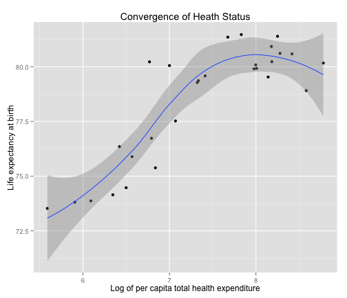

Diverging health expectancy and growing health expenditure in the European Union: a sustainable trend? A reproducible analysis in R knitr literate programming
==========================================================================================

### Stefano Olgiati (1), Niccolò Marchionni (2), Marco Scatigna (3), Emilio Clementi (4), Alessandro Danovi (5), Paolo Rossetti (6), Roberto Weinstein (7), Giancarlo Cesana (8)

1.  Author Responsible For Correspondence: University of Bergamo <www.unibg.it>, Department of Quantitative Methods, via dei Caniana 2, Bergamo (ITA) 24129; phone  +39 035 20 52 638; fax +39 035 20 52 549; email <stefano.olgiati@unibg.it>
2. University of Florence, Department of Experimental and Clinical Medicine, Research Unit of Medicine of Aging, Firenze (ITA) 50121
3. University of Milano, School of Specialty in Medical Pharmacology, Milano (ITA) 20100 
4. University of Milano, Department of Biomedical and Clinical Sciences “L. Sacco”, Milano (ITA) 20100
5. University of Bergamo, Department of Economics, Bergamo (ITA) 24129
6. University of  Italian Switzerland, Department of Informatics, Lugano (CH) 6900
7. University of Milano, Department of Biomedical and Clinical Sciences, Milano (ITA) 20100
8. University of Milano Bicocca, Department of Statistics and Quantitative Methods, Monza (ITA) 20900


### ABSTRACT
**Background**
The European Union is characterised by overall improving life expectancy at birth in the period 1970-2009, with some socioeconomic inequalities remaining unsolved and affecting the equal distribution of health outcomes, in particular in eastern Europe. Following the *incipit* of the 2008 financial crisis some concerns have arisen regarding the effects of an enduring crisis on public health in some distressed countries like Italy, Greece and Portugal. 

**Research Goal**
In this paper we have tested the hypothesis that, across the European Union in 2010, health adjusted life expectancy diverges and per capita health expenditure increases and is correlated to the number of years lived with disease.

**Methods and Reproducibility**
This research is completely repoducible. No human manual intervention has occurred in the downloading, processing and analysis of the Global Burden of Disease 2010 and WHO 2010 datasets. All bibliography is automatically generated and DOI referenced.

**Findings**
We found evidence in support of the divergence of health and socioeconomic status and the diminishing returns of health expenditure hypothesis in the European Union in 2010. We also found evidence in support of the expansion of morbidity and growing health expenditure hypothesis.

**Interpretation**
In the European Union healthy life expectancy is diverging and at a growing cost. A public health policy aimed at preventing disease accross the Union rather than treating it could have a positive impact on the sustainability of health spending.
 


```
## Loading required package: bitops
## Loading required package: bibtex
## 
## Attaching package: 'knitcitations'
## 
## The following object is masked from 'package:utils':
## 
##     cite
```


### 1. BACKGROUND
The European Union is characterised by overall improving life expectancy at birth in the period 1970-2009 (<a href="http://dx.doi.org/10.1093/ije/dyr061">Leon, 2011</a>) [See Figure 1] ("http://ije.oxfordjournals.org/content/40/2/271/F1.expansion.html") with some socioeconomic inequalities remaining unsolved and affecting the equal distribution of health outcomes (<a href="http://dx.doi.org/10.1056/NEJMsa0707519">Mackenbach et al. 2008</a>) in particular in eastern Europe (<a href="http://dx.doi.org/10.2307/3246630">Meslé et al. 2002</a>; <a href="http://dx.doi.org/10.1017/S106279870999010X">Vågerö, 2009</a>). These findings have been confirmed by the Global Burden of Disease study 2010 (<a href="http://dx.doi.org/10.1016/S0140-6736(12)61729-2">Vos et al. 2012</a>).

Following the *incipit* of the 2008 financial crisis, Karanikolos et al. in 2013 (<a href="http://dx.doi.org/10.1016/S0140-6736(13)60102-6">Karanikolos et al. 2013</a>) have risen some concerns regarding the effects of an enduring crisis on public health in some distressed countries like Italy, Greece and Portugal.

In this paper we have tested the hypothesis that, across the European Union in 2010, health adjusted life expectancy diverges and per capita health expenditure increases and is correlated to the number of years lived with disease.

If this hypothesis cannot be rejected, a public health policy aimed at preventing disease rather than treating it could have a positive impact on the sustainability of health spending in less developeded EU economies.

The reproducible literate codes of this research are available at the public repository on [github.com/SAO65/YLD_2010_EU28]("https://github.com/SAO65/YLD_2010_EU28")

### 2. LITERATURE
In literature the relationship between health expenditure and life expectancy is grounded on two major hypotheses:

*Hypothesis I) the convergence/divergence of health and socioeconomic status and the diminishing returns of health expenditure*;   
*Hypothesis II) the expansion of morbidity hypothesis and the growth of health expenditure*.

#### Hypothesis I) The convergence of health and socioeconomic status and the diminishing returns of health expenditure
Social epidemiologists and economists have since long debated the relationship between life expectancy and socioeconomic status. The role of *distal* socioeconomic determinants of health such as gross domestic product per capita, health expenditure and health coverage was originally proposed by Preston in 1975 (<a href="http://dx.doi.org/10.2307/2173509">Preston, 1975</a>), McMichael in 1999 (<a href="http://dx.doi.org/10.1093/oxfordjournals.aje.a009732">McMichael, 1999</a>) and 2004 (<a href="http://dx.doi.org/10.1016/S0140-6736(04)15902-3">McMichael et al. 2004</a>) and Deaton in 2003 (<a href="http://dx.doi.org/10.1257/002205103321544710">Deaton, 2003</a>). In general, if life expectancy is considered a sufficiently explanatory descriptor of health outcomes (<a href="http://dx.doi.org/10.1093/ije/dyr061">Leon, 2011</a>), the hypothesis to be tested is if a growing health expenditure is correlated to a longer life expectancy and if this correlation is characterised or not by diminishing returns (**Figure 1**).

**Figure 1: Function of convergence of health and socioeconomic status and the diminishing returns of health expenditure**


#### Hypothesis II) The expansion of morbidity hypothesis and the growth of health expenditure
In alternative, increased health spending can be explained by the growth in the number of years lived with disability which, in turn, can be explained by the growth of overall life expectancy at birth (**Figure 2**).

As Salomon and colleagues (<a href="http://dx.doi.org/10.1016/S0140-6736(12)61690-0">Salomon et al. 2012</a>) summarised in the Global Burden of Disease Study (February 2013 update) (<a href="http://dx.doi.org/10.1016/S0140-6736(12)61729-2">Vos et al. 2012</a>), improving health: “means more than simply delaying death or increasing life expectancy at birth”, and “in the period 1990-2010 improvements in healthy life expectancy have mainly been achieved through reductions of child and adult mortality rates rather than reductions in non-fatal diseases, health risks and injuries”, which might imply survival, but with residual functional limitations and disabilities.

**Figure 2: Function of Expansion of morbidity hypothesis and growth of health expenditure**


### 3. RESEARCH GOAL
We have reproduced the analysis under the assumptions of Hypothesis I and II for the European Union in the year 2010 in order to test the alternative hypotheses of health status convergence/divergence and expansion of morbidity, and their relationship with health expenditure.

### 4. CODE BOOK, METHODS AND RAW DATA
We utilized open access data from the Institute for Health Metrics and Evaluation (IHME) Global Burden of Disease Study 2010 [GHDx]("http://ghdx.healthmetricsandevaluation.org/sites/default/files/record-attached-files/IHME_GBD_2010_HALE_BY_COUNTRY_1990_2010_Y2010M02D23.CSV") and from the World Health Organization’s [Data Repository on Health Expenditure]("http://apps.who.int/gho/athena/data/xmart.csv?target=GHO/WHS7_156,WHS7_105,WHS7_104,WHS7_108&profile=xmart&filter=COUNTRY:*;REGION:AFR;REGION:AMR;REGION:SEAR;REGION:EUR;REGION:EMR;REGION:WPR").

#### Code Book
The following variables and definitions, based on “The Global Burden of Disease: Generating Evidence, Guiding Policy” and the World Health Organization’s Data Repository on Health Expenditure, were adopted when extracting the tidy data set from the raw data:
* Life Expectancy (LE): Life Expectancy at birth is the average number of years that a person can be expected to live from birth;
* Healthy Life Expectancy (HALE): Healthy Life Expectancy is the average number of years that a person can be expected to live in “full health”, by taking into account years lived in less than full health with disease and/or non-fatal injury ;
* Years Lived with Disability (YLD): The Years Lived with Disability is the difference between LE and HALE, where LE is always greater than or equal to HALE. It is equivalent to the number of years that people live with a health condition or its consequences or in less than full health with disease and/or non-fatal injury , .
* Total Health Expenditure (THE): Total Health Expenditure includes public (government, external resources for health from international programs and social security) and private expenditure (private pre-paid plans and out-of-pocket). For the purpose of international comparisons, THE is expressed in International Purchase Power Parity United States Dollars (USD PPP) which, according to the World Bank, is the number of units of a country’s currency required to buy the same amounts of goods and services in the domestic market as one US Dollar would buy in the United States;
* Log of Total Health Expenditure (log.THE): the natural log of Total Health Expenditure (THE)

#### Getting Data Code

```r
# Getting raw data from the IHME Global Burden of Disease Study 2010
fileURL.GBD <- "http://ghdx.healthmetricsandevaluation.org/sites/default/files/record-attached-files/IHME_GBD_2010_HALE_BY_COUNTRY_1990_2010_Y2010M02D23.CSV"
# Getting raw data from the WHO Health Expenditure Repository
fileURL.WHO <- "http://apps.who.int/gho/athena/data/xmart.csv?target=GHO/WHS7_156,WHS7_105,WHS7_104,WHS7_108&profile=xmart&filter=COUNTRY:*;REGION:AFR;REGION:AMR;REGION:SEAR;REGION:EUR;REGION:EMR;REGION:WPR"
download.file(fileURL.GBD, destfile = "/Users/Stefanoolgiati/Desktop/YLD/YLD.RPubs/YLD_2010_EU28/GBD.csv")
download.file(fileURL.WHO, destfile = "/Users/Stefanoolgiati/Desktop/YLD/YLD.RPubs/YLD_2010_EU28/WHO.csv")
dateDownloaded <- date()
dateDownloaded
```

```
## [1] "Sun May 18 09:41:08 2014"
```


### Analytic Data


#### ISO 13 codes of 28 Countries of the EU for which complete datasets were available

```r
EU28 <- c("AUT", "BEL", "BGR", "HRV", "CYP", "CZE", "DNK", "EST", "FIN", "FRA", 
    "DEU", "GRC", "HUN", "IRL", "ITA", "LVA", "LTU", "LUX", "MLT", "NLD", "POL", 
    "PRT", "ROU", "SVK", "SVN", "ESP", "SWE", "GBR")
length(EU28) == 28
```

```
## [1] TRUE
```

```r

data.GBD <- DT.GBD[DT.GBD$year == "2010" & DT.GBD$age_name == "0-1 years" & 
    DT.GBD$sex_name == "Both" & DT.GBD$iso3 %in% EU28, ]
data.GBD.ordered <- data.GBD[order(iso3), ]

data.WHO <- DT.WHO[DT.WHO$YEAR == "2010" & DT.WHO$GHO == "WHS7_104" & DT.WHO$COUNTRY %in% 
    EU28, ]
data.WHO.ordered <- data.WHO[order(COUNTRY), ]

data <- data.frame(country = data.GBD.ordered$iso3, le = data.GBD.ordered$le, 
    hale = data.GBD.ordered$hale, the = data.WHO.ordered$Display)

yld <- data$le - data$hale

log.the <- log(data.WHO.ordered$Display)

# Tidy Dataset
tidy.data <- data.frame(country = data.GBD.ordered$iso3, the = data.WHO.ordered$Display, 
    log.the, le = data.GBD.ordered$le, hale = data.GBD.ordered$hale, yld)
attach(tidy.data)
```

```
## The following objects are masked _by_ .GlobalEnv:
## 
##     log.the, yld
## The following objects are masked from raw.data.GBD:
## 
##     hale, le
```


The tidy dataset in **Table 1** has been generated:

**Table 1: Tidy dataset**
<!-- html table generated in R 3.1.0 by xtable 1.7-3 package -->
<!-- Mon May 19 09:18:34 2014 -->
<TABLE border=1>
<TR> <TH>  </TH> <TH> country </TH> <TH> the </TH> <TH> log.the </TH> <TH> le </TH> <TH> hale </TH> <TH> yld </TH>  </TR>
  <TR> <TD align="right"> 1 </TD> <TD> AUT </TD> <TD align="right"> 3937.10 </TD> <TD align="right"> 8.28 </TD> <TD align="right"> 80.61 </TD> <TD align="right"> 69.13 </TD> <TD align="right"> 11.48 </TD> </TR>
  <TR> <TD align="right"> 2 </TD> <TD> BEL </TD> <TD align="right"> 3431.80 </TD> <TD align="right"> 8.14 </TD> <TD align="right"> 79.53 </TD> <TD align="right"> 68.54 </TD> <TD align="right"> 10.99 </TD> </TR>
  <TR> <TD align="right"> 3 </TD> <TD> BGR </TD> <TD align="right"> 267.40 </TD> <TD align="right"> 5.59 </TD> <TD align="right"> 73.53 </TD> <TD align="right"> 64.10 </TD> <TD align="right"> 9.42 </TD> </TR>
  <TR> <TD align="right"> 4 </TD> <TD> CYP </TD> <TD align="right"> 870.70 </TD> <TD align="right"> 6.77 </TD> <TD align="right"> 80.23 </TD> <TD align="right"> 68.83 </TD> <TD align="right"> 11.40 </TD> </TR>
  <TR> <TD align="right"> 5 </TD> <TD> CZE </TD> <TD align="right"> 1176.00 </TD> <TD align="right"> 7.07 </TD> <TD align="right"> 77.52 </TD> <TD align="right"> 67.24 </TD> <TD align="right"> 10.28 </TD> </TR>
  <TR> <TD align="right"> 6 </TD> <TD> DEU </TD> <TD align="right"> 3582.10 </TD> <TD align="right"> 8.18 </TD> <TD align="right"> 80.23 </TD> <TD align="right"> 69.02 </TD> <TD align="right"> 11.21 </TD> </TR>
  <TR> <TD align="right"> 7 </TD> <TD> DNK </TD> <TD align="right"> 5334.10 </TD> <TD align="right"> 8.58 </TD> <TD align="right"> 78.91 </TD> <TD align="right"> 67.87 </TD> <TD align="right"> 11.04 </TD> </TR>
  <TR> <TD align="right"> 8 </TD> <TD> ESP </TD> <TD align="right"> 2153.40 </TD> <TD align="right"> 7.67 </TD> <TD align="right"> 81.35 </TD> <TD align="right"> 70.92 </TD> <TD align="right"> 10.43 </TD> </TR>
  <TR> <TD align="right"> 9 </TD> <TD> EST </TD> <TD align="right"> 711.60 </TD> <TD align="right"> 6.57 </TD> <TD align="right"> 75.89 </TD> <TD align="right"> 65.68 </TD> <TD align="right"> 10.21 </TD> </TR>
  <TR> <TD align="right"> 10 </TD> <TD> FIN </TD> <TD align="right"> 2973.60 </TD> <TD align="right"> 8.00 </TD> <TD align="right"> 80.09 </TD> <TD align="right"> 67.30 </TD> <TD align="right"> 12.78 </TD> </TR>
  <TR> <TD align="right"> 11 </TD> <TD> FRA </TD> <TD align="right"> 3565.30 </TD> <TD align="right"> 8.18 </TD> <TD align="right"> 80.93 </TD> <TD align="right"> 69.48 </TD> <TD align="right"> 11.44 </TD> </TR>
  <TR> <TD align="right"> 12 </TD> <TD> GBR </TD> <TD align="right"> 2915.00 </TD> <TD align="right"> 7.98 </TD> <TD align="right"> 79.91 </TD> <TD align="right"> 68.62 </TD> <TD align="right"> 11.28 </TD> </TR>
  <TR> <TD align="right"> 13 </TD> <TD> GRC </TD> <TD align="right"> 1657.00 </TD> <TD align="right"> 7.41 </TD> <TD align="right"> 79.58 </TD> <TD align="right"> 68.67 </TD> <TD align="right"> 10.91 </TD> </TR>
  <TR> <TD align="right"> 14 </TD> <TD> HRV </TD> <TD align="right"> 891.00 </TD> <TD align="right"> 6.79 </TD> <TD align="right"> 76.73 </TD> <TD align="right"> 66.00 </TD> <TD align="right"> 10.74 </TD> </TR>
  <TR> <TD align="right"> 15 </TD> <TD> HUN </TD> <TD align="right"> 664.80 </TD> <TD align="right"> 6.50 </TD> <TD align="right"> 74.47 </TD> <TD align="right"> 64.25 </TD> <TD align="right"> 10.22 </TD> </TR>
  <TR> <TD align="right"> 16 </TD> <TD> IRL </TD> <TD align="right"> 3004.70 </TD> <TD align="right"> 8.01 </TD> <TD align="right"> 79.93 </TD> <TD align="right"> 68.87 </TD> <TD align="right"> 11.06 </TD> </TR>
  <TR> <TD align="right"> 17 </TD> <TD> ITA </TD> <TD align="right"> 2516.30 </TD> <TD align="right"> 7.83 </TD> <TD align="right"> 81.47 </TD> <TD align="right"> 70.17 </TD> <TD align="right"> 11.30 </TD> </TR>
  <TR> <TD align="right"> 18 </TD> <TD> LTU </TD> <TD align="right"> 570.10 </TD> <TD align="right"> 6.35 </TD> <TD align="right"> 74.15 </TD> <TD align="right"> 64.29 </TD> <TD align="right"> 9.86 </TD> </TR>
  <TR> <TD align="right"> 19 </TD> <TD> LUX </TD> <TD align="right"> 6493.70 </TD> <TD align="right"> 8.78 </TD> <TD align="right"> 80.17 </TD> <TD align="right"> 68.43 </TD> <TD align="right"> 11.74 </TD> </TR>
  <TR> <TD align="right"> 20 </TD> <TD> LVA </TD> <TD align="right"> 442.10 </TD> <TD align="right"> 6.09 </TD> <TD align="right"> 73.87 </TD> <TD align="right"> 63.76 </TD> <TD align="right"> 10.11 </TD> </TR>
  <TR> <TD align="right"> 21 </TD> <TD> MLT </TD> <TD align="right"> 1096.70 </TD> <TD align="right"> 7.00 </TD> <TD align="right"> 80.05 </TD> <TD align="right"> 68.68 </TD> <TD align="right"> 11.37 </TD> </TR>
  <TR> <TD align="right"> 22 </TD> <TD> NLD </TD> <TD align="right"> 4520.50 </TD> <TD align="right"> 8.42 </TD> <TD align="right"> 80.59 </TD> <TD align="right"> 69.08 </TD> <TD align="right"> 11.51 </TD> </TR>
  <TR> <TD align="right"> 23 </TD> <TD> POL </TD> <TD align="right"> 615.60 </TD> <TD align="right"> 6.42 </TD> <TD align="right"> 76.35 </TD> <TD align="right"> 66.06 </TD> <TD align="right"> 10.29 </TD> </TR>
  <TR> <TD align="right"> 24 </TD> <TD> PRT </TD> <TD align="right"> 1532.30 </TD> <TD align="right"> 7.33 </TD> <TD align="right"> 79.36 </TD> <TD align="right"> 68.59 </TD> <TD align="right"> 10.78 </TD> </TR>
  <TR> <TD align="right"> 25 </TD> <TD> ROU </TD> <TD align="right"> 367.40 </TD> <TD align="right"> 5.91 </TD> <TD align="right"> 73.81 </TD> <TD align="right"> 64.36 </TD> <TD align="right"> 9.45 </TD> </TR>
  <TR> <TD align="right"> 26 </TD> <TD> SVK </TD> <TD align="right"> 932.60 </TD> <TD align="right"> 6.84 </TD> <TD align="right"> 75.38 </TD> <TD align="right"> 65.37 </TD> <TD align="right"> 10.01 </TD> </TR>
  <TR> <TD align="right"> 27 </TD> <TD> SVN </TD> <TD align="right"> 1512.20 </TD> <TD align="right"> 7.32 </TD> <TD align="right"> 79.28 </TD> <TD align="right"> 68.28 </TD> <TD align="right"> 11.00 </TD> </TR>
  <TR> <TD align="right"> 28 </TD> <TD> SWE </TD> <TD align="right"> 3826.30 </TD> <TD align="right"> 8.25 </TD> <TD align="right"> 81.39 </TD> <TD align="right"> 69.64 </TD> <TD align="right"> 11.75 </TD> </TR>
   </TABLE>

**Source: GBDS 2010 and WHO**


### 5. FINDINGS
We found evidence in support of the divergence of health and socioeconomic status and the diminishing returns of health expenditure hypothesis in the European Union in 2010 (**Figure 3**). 

**Figure 3: Convergence of health and socioeconomic status and the diminishing returns of health expenditure in the European Union in 2010**

```
## geom_smooth: method="auto" and size of largest group is <1000, so using loess. Use 'method = x' to change the smoothing method.
```



**Source: GBDS 2010 and WHO**

We also found evidence in support of the expansion of morbidity (**Table 2**) and growing health expenditure (**Table 3**) hypothesis in the European Union in 2010 (**Figure 4**).

**Figure 4: Expansion of morbidity hypothesis and growth of health expenditure in the European Union in 2010**


**Source: GBDS 2010 and WHO**


```r
# Analysis Code
lm.fit1 <- lm(yld ~ le)
lm.fit2 = lm(log.the ~ yld)
```


**Table 2: Expansion of morbidity hypothesis in the European Union in 2010**
<!-- html table generated in R 3.1.0 by xtable 1.7-3 package -->
<!-- Mon May 19 09:18:35 2014 -->
<TABLE border=1>
<TR> <TH>  </TH> <TH> Estimate </TH> <TH> Std. Error </TH> <TH> t value </TH> <TH> Pr(&gt;|t|) </TH>  </TR>
  <TR> <TD align="right"> (Intercept) </TD> <TD align="right"> -7.8397 </TD> <TD align="right"> 2.4456 </TD> <TD align="right"> -3.21 </TD> <TD align="right"> 0.0036 </TD> </TR>
  <TR> <TD align="right"> le </TD> <TD align="right"> 0.2385 </TD> <TD align="right"> 0.0312 </TD> <TD align="right"> 7.65 </TD> <TD align="right"> 0.0000 </TD> </TR>
   </TABLE>
<!-- html table generated in R 3.1.0 by xtable 1.7-3 package -->
<!-- Mon May 19 09:18:35 2014 -->
<TABLE border=1>
<TR> <TH>  </TH> <TH> 2.5 % </TH> <TH> 97.5 % </TH>  </TR>
  <TR> <TD align="right"> (Intercept) </TD> <TD align="right"> -12.87 </TD> <TD align="right"> -2.81 </TD> </TR>
  <TR> <TD align="right"> le </TD> <TD align="right"> 0.17 </TD> <TD align="right"> 0.30 </TD> </TR>
   </TABLE>

**Source: GBDS 2010 and WHO**
  
  
  
**Table 3: Growth of health expenditure in the European Union in 2010**
<!-- html table generated in R 3.1.0 by xtable 1.7-3 package -->
<!-- Mon May 19 09:18:35 2014 -->
<TABLE border=1>
<TR> <TH>  </TH> <TH> Estimate </TH> <TH> Std. Error </TH> <TH> t value </TH> <TH> Pr(&gt;|t|) </TH>  </TR>
  <TR> <TD align="right"> (Intercept) </TD> <TD align="right"> -2.6602 </TD> <TD align="right"> 1.5045 </TD> <TD align="right"> -1.77 </TD> <TD align="right"> 0.0888 </TD> </TR>
  <TR> <TD align="right"> yld </TD> <TD align="right"> 0.9232 </TD> <TD align="right"> 0.1382 </TD> <TD align="right"> 6.68 </TD> <TD align="right"> 0.0000 </TD> </TR>
   </TABLE>
<!-- html table generated in R 3.1.0 by xtable 1.7-3 package -->
<!-- Mon May 19 09:18:35 2014 -->
<TABLE border=1>
<TR> <TH>  </TH> <TH> 2.5 % </TH> <TH> 97.5 % </TH>  </TR>
  <TR> <TD align="right"> (Intercept) </TD> <TD align="right"> -5.75 </TD> <TD align="right"> 0.43 </TD> </TR>
  <TR> <TD align="right"> yld </TD> <TD align="right"> 0.64 </TD> <TD align="right"> 1.21 </TD> </TR>
   </TABLE>

**Source: GBDS 2010 and WHO**

In synthesis, we found that in 2010, across 28 Countries of the European Union, the number of Years Lived with Disease is a linear functon of Life Expectancy and the log of per capita Total Health Expenditure is a linear function of the number of Years Lived with Disability. We have called this relationship Disability Costs Function.

In general, this epidemiological relationship is true for almost all high- and middle-income European countries . The Institute for Health Metrics and Evaluation (IHME) Global Burden of Disease Study 2010 (2013 update) has found evidence in favour of the global expansion of morbidity hypothesis (<a href="http://dx.doi.org/10.1001/jama.2013.13805">Murray, 2013</a>). 

### 6. INTERPRETATION
These results confirm the findings in the US by Murray et al. (<a href="http://dx.doi.org/10.1056/NEJMra1201534">Murray & Lopez, 2013</a>)  in the United States who concluded that “the US [...] made notable progress in improving health in the two decades from 1990 to 2010” but “in a marked shift, non-fatal disease and disability accounted for almost half of all health burden in the US in 2010”.

In Greek mythology Sisyphus was the symbol of futile labour  condemned to push a boulder up a hill only to watch it roll back down, and repeat this action forever . European public health policymakers might be heading towards the same fate: while there is an improvement in socioeconomic distal determinants of health (such as per capita Gross Domestic Product , living standards and education, accessibility to health services  and medical practices  with reduced inequalities and crime rates), and life expectancy at birth in all 28 EU countries continues to rise, at the same time the number of years lived with disease, non-fatal injury and disability also increases , requiring policymakers to invest more and more economic resources in health care. 

The implications of the Disability Costs Function are not trivial:

a) Comparing among different countries, the efficiency of health spending is significant only vertically along the Disability Costs Function, and effectiveness is significant only horizontally;

b) If adequate public health policies aimed at preventing non-fatal disease and injury are not adopted , countries with lower life expectancy at birth, lower number of years lived with disability and lower per capita total health expenditure, like Bulgaria, Romania, Lithuania, Latvia, Estonia, Poland, Hungary, Czech Republic and Slovakia will face exponential growth in disability and health expenditure as life expectancy at birth improves;

c) European financial stability goals and policies aimed at securing economic and financial sustainability of health financing in the EU  should take into account the differential burden of disability and promote reforms towards reducing the incidence, duration and severity of disabling diseases as overall life expectancy increases in the Union;

d) European countries enduring the 2008 financial crisis , such as Greece, Cyprus, Portugal, Italy, Ireland and Spain, which are forced to adopt budgetary reform measures, should focus on cost-effective public health policies aimed at moving horizontally along the Disability Costs Function towards reducing disability at the present total health expenditure per capita.

We conclude that the value of a sustainable public health policy should also be measured in terms of increasing health-adjusted life expectancy (HALE) and reducing the number of years lived with disability (YLD) “given” a certain level of total health expenditure per capita in terms of less money spent for more years lived in good health.

In the absence of these goals, political economy and health economic policies will deliver more wealth per capita and a longer life, but also, at the same time, more years of disease - and at a higher cost.

### 7. DISCUSSION AND LIMITS
The East-West health gap in the European Union is a well known object of scientific research (<a href="http://dx.doi.org/10.1093/eurpub/ckm006" rel="http://purl.org/spar/cito/10.1093/ije/26.1.75" >Zatonski, 2007</a>) and life expectancy is an outcome indicator with many limitations (<a href="http://dx.doi.org/10.1126/science.1069675">Oeppen, 2002</a>). The purpose of this paper is not to propose a novel interpretation of well known trends and facts, but to assess the reproducibility of the main hypotheses underlyng the growth of health expenditure for public health and public health policy purposes.

### 8. REFERENCES  

```
## 
## - Angus Deaton,   (2003) Health, Inequality, And Economic Development.  *Journal of Economic Literature*  **41**  113-158  [10.1257/002205103321544710](http://dx.doi.org/10.1257/002205103321544710)
## - Marina Karanikolos, Philipa Mladovsky, Jonathan Cylus, Sarah Thomson, Sanjay Basu, David Stuckler, Johan P Mackenbach, Martin McKee,   (2013) Financial Crisis, Austerity, And Health in Europe.  *The Lancet*  **381**  1323-1331  [10.1016/S0140-6736(13)60102-6](http://dx.doi.org/10.1016/S0140-6736(13)60102-6)
## - D. A. Leon,   (2011) Trends in European Life Expectancy: A Salutary View.  *International Journal of Epidemiology*  **40**  271-277  [10.1093/ije/dyr061](http://dx.doi.org/10.1093/ije/dyr061)
## - Johan P. Mackenbach, Irina Stirbu, Albert-Jan R. Roskam, Maartje M. Schaap, Gwenn Menvielle, Mall Leinsalu, Anton E. Kunst,   (2008) Socioeconomic Inequalities in Health in 22 European Countries.  *New England Journal of Medicine*  **358**  2468-2481  [10.1056/NEJMsa0707519](http://dx.doi.org/10.1056/NEJMsa0707519)
## - A. J. McMichael,   (1999) Prisoners of The Proximate: Loosening The Constraints on Epidemiology in an Age of Change.  *American Journal of Epidemiology*  **149**  887-897  [10.1093/oxfordjournals.aje.a009732](http://dx.doi.org/10.1093/oxfordjournals.aje.a009732)
## - Anthony J McMichael, Martin McKee, Vladimir Shkolnikov, Tapani Valkonen,   (2004) Mortality Trends And Setbacks: Global Convergence or Divergence?.  *The Lancet*  **363**  1155-1159  [10.1016/S0140-6736(04)15902-3](http://dx.doi.org/10.1016/S0140-6736(04)15902-3)
## - France Meslé, Jacques Vallin, Zoe Andreyev, France Mesle,   (2002) Mortality in Europe: The Divergence Between East And West.  *Population (English Edition, 2002-)*  **57**  157-NA  [10.2307/3246630](http://dx.doi.org/10.2307/3246630)
## - Christopher J. L. Murray,   (2013) The State of us Health, 1990-2010.  *Jama*  **310**  591-NA  [10.1001/jama.2013.13805](http://dx.doi.org/10.1001/jama.2013.13805)
## - Christopher J.L. Murray, Alan D. Lopez,   (2013) Measuring The Global Burden of Disease.  *New England Journal of Medicine*  **369**  448-457  [10.1056/NEJMra1201534](http://dx.doi.org/10.1056/NEJMra1201534)
## - J. Oeppen,   (2002) Demography: Enhanced: Broken Limits to Life Expectancy.  *Science*  **296**  1029-1031  [10.1126/science.1069675](http://dx.doi.org/10.1126/science.1069675)
## - Samuel H. Preston,   (1975) The Changing Relation Between Mortality And Level of Economic Development.  *Population Studies*  **29**  231-NA  [10.2307/2173509](http://dx.doi.org/10.2307/2173509)
## - Joshua A Salomon, Haidong Wang, Michael K Freeman, Theo Vos, Abraham D Flaxman, Alan D Lopez, Christopher JL Murray,   (2012) Healthy Life Expectancy For 187 Countries, 1990–2010: A Systematic Analysis For The Global Burden Disease Study 2010.  *The Lancet*  **380**  2144-2162  [10.1016/S0140-6736(12)61690-0](http://dx.doi.org/10.1016/S0140-6736(12)61690-0)
## - Denny Vågerö,   (2009) The East–West Health Divide in Europe: Growing And Shifting Eastwards.  *European Review*  **18**  23-NA  [10.1017/S106279870999010X](http://dx.doi.org/10.1017/S106279870999010X)
## - Theo Vos, Abraham D Flaxman, Mohsen Naghavi, Rafael Lozano, Catherine Michaud, Majid Ezzati, Kenji Shibuya, Joshua A Salomon, Safa Abdalla, Victor Aboyans, Jerry Abraham, Ilana Ackerman, Rakesh Aggarwal, Stephanie Y Ahn, Mohammed K Ali, Mohammad A AlMazroa, Miriam Alvarado, H Ross Anderson, Laurie M Anderson, Kathryn G Andrews, Charles Atkinson, Larry M Baddour, Adil N Bahalim, Suzanne Barker-Collo, Lope H Barrero, David H Bartels, Maria-Gloria Basáñez, Amanda Baxter, Michelle L Bell, Emelia J Benjamin, Derrick Bennett, Eduardo Bernabé, Kavi Bhalla, Bishal Bhandari, Boris Bikbov, Aref Bin Abdulhak, Gretchen Birbeck, James A Black, Hannah Blencowe, Jed D Blore, Fiona Blyth, Ian Bolliger, Audrey Bonaventure, Soufiane Boufous, Rupert Bourne, Michel Boussinesq, Tasanee Braithwaite, Carol Brayne, Lisa Bridgett, Simon Brooker, Peter Brooks, Traolach S Brugha, Claire Bryan-Hancock, Chiara Bucello, Rachelle Buchbinder, Geoffrey Buckle, Christine M Budke, Michael Burch, Peter Burney, Roy Burstein, Bianca Calabria, Benjamin Campbell, Charles E Canter, Hélène Carabin, Jonathan Carapetis, Loreto Carmona, Claudia Cella, Fiona Charlson, Honglei Chen, Andrew Tai-Ann Cheng, David Chou, Sumeet S Chugh, Luc E Coffeng, Steven D Colan, Samantha Colquhoun, K Ellicott Colson, John Condon, Myles D Connor, Leslie T Cooper, Matthew Corriere, Monica Cortinovis, Karen Courville de Vaccaro, William Couser, Benjamin C Cowie, Michael H Criqui, Marita Cross, Kaustubh C Dabhadkar, Manu Dahiya, Nabila Dahodwala, James Damsere-Derry, Goodarz Danaei, Adrian Davis, Diego De Leo, Louisa Degenhardt, Robert Dellavalle, Allyne Delossantos, Julie Denenberg, Sarah Derrett, Don C Des Jarlais, Samath D Dharmaratne, Mukesh Dherani, Cesar Diaz-Torne, Helen Dolk, E Ray Dorsey, Tim Driscoll, Herbert Duber, Beth Ebel, Karen Edmond, Alexis Elbaz, Suad Eltahir Ali, Holly Erskine, Patricia J Erwin, Patricia Espindola, Stalin E Ewoigbokhan, Farshad Farzadfar, Valery Feigin, David T Felson, Alize Ferrari, Cleusa P Ferri, Eric M Fèvre, Mariel M Finucane, Seth Flaxman, Louise Flood, Kyle Foreman, Mohammad H Forouzanfar, Francis Gerry R Fowkes, Richard Franklin, Marlene Fransen, Michael K Freeman, Belinda J Gabbe, Sherine E Gabriel, Emmanuela Gakidou, Hammad A Ganatra, Bianca Garcia, Flavio Gaspari, Richard F Gillum, Gerhard Gmel, Richard Gosselin, Rebecca Grainger, Justina Groeger, Francis Guillemin, David Gunnell, Ramyani Gupta, Juanita Haagsma, Holly Hagan, Yara A Halasa, Wayne Hall, Diana Haring, Josep Maria Haro, James E Harrison, Rasmus Havmoeller, Roderick J Hay, Hideki Higashi, Catherine Hill, Bruno Hoen, Howard Hoffman, Peter J Hotez, Damian Hoy, John J Huang, Sydney E Ibeanusi, Kathryn H Jacobsen, Spencer L James, Deborah Jarvis, Rashmi Jasrasaria, Sudha Jayaraman, Nicole Johns, Jost B Jonas, Ganesan Karthikeyan, Nicholas Kassebaum, Norito Kawakami, Andre Keren, Jon-Paul Khoo, Charles H King, Lisa Marie Knowlton, Olive Kobusingye, Adofo Koranteng, Rita Krishnamurthi, Ratilal Lalloo, Laura L Laslett, Tim Lathlean, Janet L Leasher, Yong Yi Lee, James Leigh, Stephen S Lim, Elizabeth Limb, John Kent Lin, Michael Lipnick, Steven E Lipshultz, Wei Liu, Maria Loane, Summer Lockett Ohno, Ronan Lyons, Jixiang Ma, Jacqueline Mabweijano, Michael F MacIntyre, Reza Malekzadeh, Leslie Mallinger, Sivabalan Manivannan, Wagner Marcenes, Lyn March, David J Margolis, Guy B Marks, Robin Marks, Akira Matsumori, Richard Matzopoulos, Bongani M Mayosi, John H McAnulty, Mary M McDermott, Neil McGill, John McGrath, Maria Elena Medina-Mora, Michele Meltzer, Ziad A Memish, George A Mensah, Tony R Merriman, Ana-Claire Meyer, Valeria Miglioli, Matthew Miller, Ted R Miller, Philip B Mitchell, Ana Olga Mocumbi, Terrie E Moffitt, Ali A Mokdad, Lorenzo Monasta, Marcella Montico, Maziar Moradi-Lakeh, Andrew Moran, Lidia Morawska, Rintaro Mori, Michele E Murdoch, Michael K Mwaniki, Kovin Naidoo, M Nathan Nair, Luigi Naldi, KM Venkat Narayan, Paul K Nelson, Robert G Nelson, Michael C Nevitt, Charles R Newton, Sandra Nolte, Paul Norman, Rosana Norman, Martin O'Donnell, Simon O'Hanlon, Casey Olives, Saad B Omer, Katrina Ortblad, Richard Osborne, Doruk Ozgediz, Andrew Page, Bishnu Pahari, Jeyaraj Durai Pandian, Andrea Panozo Rivero, Scott B Patten, Neil Pearce, Rogelio Perez Padilla, Fernando Perez-Ruiz, Norberto Perico, Konrad Pesudovs, David Phillips, Michael R Phillips, Kelsey Pierce, Sébastien Pion, Guilherme V Polanczyk, Suzanne Polinder, C Arden Pope, Svetlana Popova, Esteban Porrini, Farshad Pourmalek, Martin Prince, Rachel L Pullan, Kapa D Ramaiah, Dharani Ranganathan, Homie Razavi, Mathilda Regan, Jürgen T Rehm, David B Rein, Guiseppe Remuzzi, Kathryn Richardson, Frederick P Rivara, Thomas Roberts, Carolyn Robinson, Felipe Rodriguez De Leòn, Luca Ronfani, Robin Room, Lisa C Rosenfeld, Lesley Rushton, Ralph L Sacco, Sukanta Saha, Uchechukwu Sampson, Lidia Sanchez-Riera, Ella Sanman, David C Schwebel, James Graham Scott, Maria Segui-Gomez, Saeid Shahraz, Donald S Shepard, Hwashin Shin, Rupak Shivakoti, David Singh, Gitanjali M Singh, Jasvinder A Singh, Jessica Singleton, David A Sleet, Karen Sliwa, Emma Smith, Jennifer L Smith, Nicolas JC Stapelberg, Andrew Steer, Timothy Steiner, Wilma A Stolk, Lars Jacob Stovner, Christopher Sudfeld, Sana Syed, Giorgio Tamburlini, Mohammad Tavakkoli, Hugh R Taylor, Jennifer A Taylor, William J Taylor, Bernadette Thomas, W Murray Thomson, George D Thurston, Imad M Tleyjeh, Marcello Tonelli, Jeffrey A Towbin, Thomas Truelsen, Miltiadis K Tsilimbaris, Clotilde Ubeda, Eduardo A Undurraga, Marieke J van der Werf, Jim van Os, Monica S Vavilala, N Venketasubramanian, Mengru Wang, Wenzhi Wang, Kerrianne Watt, David J Weatherall, Martin A Weinstock, Robert Weintraub, Marc G Weisskopf, Myrna M Weissman, Richard A White, Harvey Whiteford, Steven T Wiersma, James D Wilkinson, Hywel C Williams, Sean RM Williams, Emma Witt, Frederick Wolfe, Anthony D Woolf, Sarah Wulf, Pon-Hsiu Yeh, Anita KM Zaidi, Zhi-Jie Zheng, David Zonies, Alan D Lopez, Christopher JL Murray,   (2012) Years Lived With Disability (Ylds) For 1160 Sequelae of 289 Diseases And Injuries 1990–2010: A Systematic Analysis For The Global Burden of Disease Study 2010.  *The Lancet*  **380**  2163-2196  [10.1016/S0140-6736(12)61729-2](http://dx.doi.org/10.1016/S0140-6736(12)61729-2)
## - W. Zatonski,   (2007) The East-West Health Gap in Europe--What Are The Causes?.  *The European Journal of Public Health*  **17**  121-121  [10.1093/eurpub/ckm006](http://dx.doi.org/10.1093/eurpub/ckm006)
```

